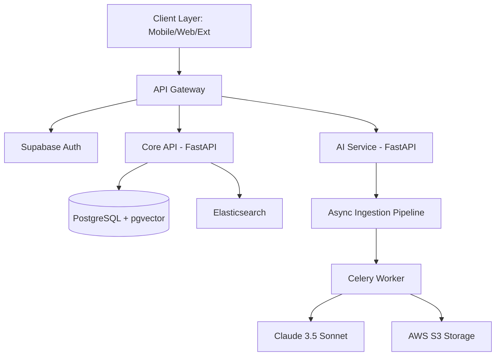

# 🧠 SecondBrain — AI-Native Personal Knowledge Management

> **"Save anything in seconds. Find everything forever."**

SecondBrain is an AI-native personal knowledge management (PKM) system designed to replace fragmented "save-to-self" habits (WhatsApp chats, browser bookmarks, gallery dumps) with a single, intelligent, self-organizing knowledge store.

---

## ✨ Core Features

### 📥 Universal Inbox
Drop any resource — photos, documents (PDF, DOCX), links, voice notes, or raw text — into a single drop zone. Accessible via mobile share sheets, browser extensions, and email.

### 🤖 AI Auto-Organization
Our AI pipeline automatically classifies, tags, summarizes, and routes every item into a semantically organized folder hierarchy. No more manual filing.

### 🕸️ Knowledge Graph
Visualize your mind with a real-time, interactive force-directed graph (Obsidian-style). See connections between ideas through semantic similarity, shared tags, and temporal proximity.

### 💬 LLM Chat Assistant
Retrieve, query, or explore your entire knowledge base using natural language. "What were those three articles about sleep I bookmarked last month?"

### 🔍 Hybrid Search
Lightning-fast search combining traditional keyword matching (Elasticsearch) with deep semantic vector search (pgvector).

---

## 🛠️ Tech Stack

### Frontend
- **Mobile:** React Native (Expo)
- **Web:** Next.js 14 (App Router)
- **State:** Zustand + React Query
- **Visualization:** D3.js + React-Force-Graph
- **Styling:** Tailwind CSS + shadcn/ui

### Backend
- **API:** FastAPI (Python)
- **Async Tasks:** Celery + Redis
- **Auth/Database:** Supabase (PostgreSQL + pgvector)
- **Search:** Elasticsearch 8

### AI / ML
- **LLMs:** Claude 3.5 Sonnet & Haiku
- **Embeddings:** OpenAI `text-embedding-3-large`
- **Vision/OCR:** Claude Vision & AWS Textract
- **Transcription:** OpenAI Whisper

---

## 🏗️ Architecture

---

## 🚀 Development Roadmap

- [ ] **Phase 1: Foundation** - Core ingestion, AI classification, and basic web/mobile UI.
- [ ] **Phase 2: Intelligence** - RAG-based chat, semantic search, and knowledge graph.
- [ ] **Phase 3: Ecosystem** - Browser extensions, WhatsApp/Telegram bots, and third-party sync (Notion/Obsidian).

---

## 📄 License

This project is licensed under the MIT License - see the [LICENSE](LICENSE) file for details.

---

  Built with ❤️ for the future of knowledge.

