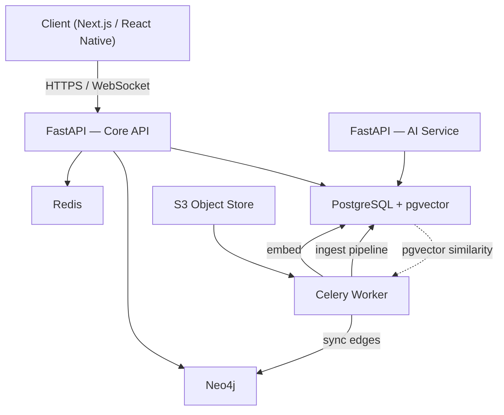
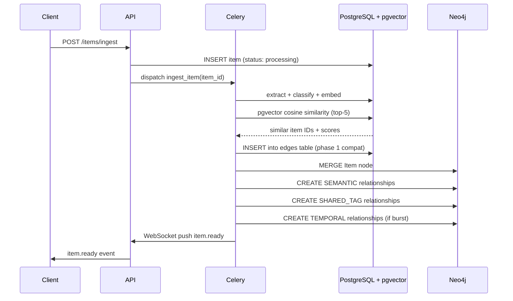
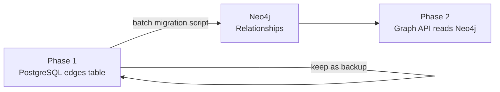

# Knowledge Graph — Phase 2 Implementation

## Table of Contents

- [[#1. Overview|Overview]]
- [[#2. What Phase 2 Changes|What Phase 2 Changes]]
- [[#3. Technology Roles|Technology Roles]]
- [[#4. High-Level Architecture|High-Level Architecture]]
- [[#5. Data Flow|Data Flow]]
- [[#6. Edge Types|Edge Types]]
- [[#7. Neo4j Schema|Neo4j Schema]]
- [[#8. pgvector — Edge Generation|pgvector — Edge Generation]]
- [[#9. Dual Database Strategy|Dual Database Strategy]]
- [[#10. Graph API|Graph API]]
- [[#11. Frontend Rendering|Frontend Rendering]]
- [[#12. Migration from Phase 1|Migration from Phase 1]]
- [[#13. Open Questions|Open Questions]]
- [[#14. References|References]]

---

## 1. Overview

Phase 2 of the SecondBrain knowledge graph introduces **Neo4j** alongside the existing PostgreSQL + pgvector stack. The goal is to replace SQL-based graph traversal (recursive CTEs on the `edges` table) with native Cypher traversal, unlocking multi-hop queries, shortest-path computation, and cluster analysis that are prohibitively expensive in relational SQL.

> **Key principle:** Neo4j does not replace PostgreSQL or pgvector. It runs in parallel. PostgreSQL owns all relational data (`users`, `items`, `folders`, `chat_sessions`). pgvector continues to generate semantic edges via cosine similarity. Neo4j exclusively owns graph traversal.

---

## 2. What Phase 2 Changes

| Component | Phase 1 | Phase 2 |
|---|---|---|
| Edge storage | `edges` table in PostgreSQL | Relationships in Neo4j |
| Graph traversal | Recursive SQL CTEs | Cypher queries |
| Semantic edge generation | pgvector cosine similarity | **Unchanged** — still pgvector |
| Relational data | PostgreSQL | **Unchanged** — still PostgreSQL |
| Graph API routes | Query `edges` table | Query Neo4j |
| Sync mechanism | N/A | Celery sync worker |

---

## 3. Technology Roles

```
pgvector  ──►  finds similar items via cosine similarity
                        │
                        ▼  (similarity score becomes edge weight)
Neo4j     ──►  stores edges as relationships, traverses them
                        │
                        ▼
FastAPI   ──►  queries Neo4j via graph API routes
                        │
                        ▼
D3.js     ──►  renders nodes and edges in the browser
```

### pgvector

- Stores `vector(1536)` embeddings on each `Item` in PostgreSQL
- Runs `ivfflat` cosine similarity queries to find top-5 nearest neighbours per item
- Similarity scores above `0.75` become `SEMANTIC` edges in Neo4j
- **Not replaced in Phase 2**

See → [[pgvector-Edge-Generation]]

### Neo4j

- Stores `Item` nodes mirrored from PostgreSQL (lightweight — id, label, type, folder, tags only)
- Stores all 5 edge types as typed relationships
- Answers multi-hop traversal queries via Cypher
- Runs as a separate service (Docker container or managed AuraDB)

See → [[Neo4j-Setup-and-Schema]]

### PostgreSQL

- Source of truth for all item data
- Neo4j is a **derived** store — it can be rebuilt from PostgreSQL at any time
- RLS, auth, and all CRUD operations remain here

---

## 4. High-Level Architecture



---

## 5. Data Flow

### Ingestion → Edge Creation → Neo4j Sync



---

## 6. Edge Types

All 5 edge types are represented as **typed relationships** in Neo4j.

| Edge Type | Cypher Relationship | Weight Range | Generated By |
|---|---|---|---|
| `SEMANTIC` | `-[:SEMANTIC {weight}]->` | 0.75 – 1.0 | pgvector cosine similarity |
| `SHARED_TAG` | `-[:SHARED_TAG {tag}]->` | 0.6 | Tag intersection (rare tags only) |
| `TEMPORAL` | `-[:TEMPORAL {weight}]->` | 0.15 – 0.45 | Burst detection in Celery |
| `ENTITY_MATCH` | `-[:ENTITY_MATCH {entity}]->` | 0.7 | Shared people/orgs/concepts |
| `USER_LINK` | `-[:USER_LINK]->` | 1.0 | `POST /items/:id/link` |

> **Tag edge rule:** only create `SHARED_TAG` edges for tags appearing on fewer than 15% of the user's total items. Frequent tags (e.g. "programming") become cluster labels, not individual edges.

> **Temporal edge rule:** only link items that are both inside a dense burst (≥3 items within 30 minutes). Isolated pairs do not get temporal edges. See → [[pgvector-Edge-Generation#Temporal Edge Logic|Temporal Edge Logic]]

---

## 7. Neo4j Schema

For a detailed breakdown of node labels, relationship properties, indexes, and constraints, see → [[Neo4j-Setup-and-Schema]]

### Summary

**Node label:** `Item`

```cypher
(:Item {
  id: "uuid",
  userId: "uuid",
  label: "React Hooks Deep Dive",
  contentType: "url",
  folder: "Programming",
  tags: ["react", "hooks"],
  viewCount: 12,
  createdAt: datetime()
})
```

**Key indexes:**

```cypher
CREATE INDEX item_user   FOR (n:Item) ON (n.userId);
CREATE INDEX item_id     FOR (n:Item) ON (n.id);
CREATE INDEX item_folder FOR (n:Item) ON (n.userId, n.folder);
```

**Key constraints:**

```cypher
CREATE CONSTRAINT item_unique FOR (n:Item) REQUIRE n.id IS UNIQUE;
```

---

## 8. pgvector — Edge Generation

pgvector runs inside PostgreSQL and generates semantic edges by finding cosine-nearest neighbours for each newly ingested item.

```sql
-- Runs in Celery after embedding is stored
INSERT INTO edges (user_id, source_id, target_id, edge_type, weight)
SELECT
  $user_id, $item_id, id, 'semantic',
  1 - (embedding <=> $new_embedding)
FROM items
WHERE user_id = $user_id
  AND id != $item_id
  AND 1 - (embedding <=> $new_embedding) > 0.75
ORDER BY embedding <=> $new_embedding
LIMIT 5
ON CONFLICT DO NOTHING;
```

The results of this query are then **synced to Neo4j** as `SEMANTIC` relationships. pgvector itself has no direct connection to Neo4j — the Celery worker bridges them.

For complete edge generation logic across all 5 types, see → [[pgvector-Edge-Generation]]

---

## 9. Dual Database Strategy

Running Neo4j alongside PostgreSQL introduces a sync problem: what is the source of truth, and how do you keep them consistent?

**Answer:** PostgreSQL is always the source of truth. Neo4j is a derived, eventually-consistent mirror of the graph subset of that data.

For full sync architecture, conflict resolution, and rebuild strategy, see → [[Dual-DB-Sync-Strategy]]

### Sync summary

| Event | Action |
|---|---|
| New item ingested | Celery `sync_item_to_neo4j(item_id)` |
| Item tags edited | Celery `recompute_edges(item_id)` |
| Item deleted | Celery `delete_node_from_neo4j(item_id)` |
| Neo4j goes down | Queue sync tasks in Redis, replay on recovery |
| Full rebuild needed | `rebuild_neo4j_from_postgres()` batch job |

---

## 10. Graph API

The graph API routes shift from querying the PostgreSQL `edges` table to querying Neo4j via Cypher.

For full route specs, query patterns, caching strategy, and ego graph BFS, see → [[Graph-API-Design]]

### Key routes

```
GET  /graph                      Full graph (top-500 nodes by connectivity)
GET  /graph?item_id=&depth=2     Ego graph — 2-hop neighbourhood of one item
GET  /graph/item/:id/neighbours  Immediate neighbours only
```

### Example Cypher — ego graph

```cypher
MATCH (start:Item {id: $itemId, userId: $userId})
MATCH (start)-[r*1..2]-(neighbour:Item {userId: $userId})
RETURN start, r, neighbour
```

### Caching

- Full graph cached in Redis: `graph:{user_id}:full` — TTL 1 hour
- Ego graphs cached: `graph:{user_id}:{item_id}:{depth}` — TTL 5 minutes
- Both invalidated on `item.ready` WebSocket event

---

## 11. Frontend Rendering

The frontend is **unchanged in Phase 2** — it consumes the same JSON shape from the graph API regardless of whether the backend uses PostgreSQL or Neo4j. The API response format stays identical:

```json
{
  "nodes": [
    { "id": "uuid", "label": "...", "type": "url", "folder": "Programming", "tags": ["react"] }
  ],
  "edges": [
    { "source": "uuid1", "target": "uuid2", "type": "semantic", "weight": 0.87 }
  ]
}
```

For rendering library details, Web Worker physics, node sizing, cluster mode, and incremental updates, see → [[Frontend-Graph-Rendering]]

---

## 12. Migration from Phase 1

Phase 1 stores edges in PostgreSQL's `edges` table. Migration to Neo4j is a one-time data pipeline, not a schema change.



### Migration steps

1. Deploy Neo4j service (Docker or AuraDB)
2. Create indexes and constraints
3. Run `migrate_edges_to_neo4j.py` — reads all rows from `edges` table, creates `Item` nodes and relationships in Neo4j in batches of 500
4. Verify node count and relationship count match PostgreSQL
5. Feature-flag the graph API to read from Neo4j
6. Monitor for 1 week; keep `edges` table as fallback
7. Deprecate `edges` table reads after confidence period

> The `edges` table in PostgreSQL is **not dropped** — it remains as a backup and for any legacy queries during the transition period.

---

## 13. Open Questions

| Question | Status | Notes |
|---|---|---|
| Neo4j deployment: self-hosted Docker vs AuraDB managed? | Open | AuraDB simpler ops, Docker cheaper at scale |
| Edge re-computation on tag edit: sync or async? | Open | Async Celery preferred to avoid blocking API |
| Graph layout persistence: Redis ephemeral vs pinned to Postgres? | Open | Redis 24h TTL + optional pin action |
| Semantic threshold 0.75 — tune per user or global? | Open | Start global, add per-user setting post-launch |
| Should the `edges` table be dropped post-migration? | Open | Keep as fallback for 3 months minimum |

---

## 14. References

- [Neo4j Cypher Manual](https://neo4j.com/docs/cypher-manual/current/)
- [pgvector GitHub](https://github.com/pgvector/pgvector)
- [react-force-graph](https://github.com/vasturiano/react-force-graph)
- [Neo4j Python Driver](https://neo4j.com/docs/api/python-driver/current/)
- [LangChain Neo4j Integration](https://python.langchain.com/docs/integrations/graphs/neo4j_cypher/)
- SecondBrain PRD v1.0 — Section 12 (Mind Map / Knowledge Graph)
- SecondBrain PRD v1.0 — Section 6 (System Architecture)

---

*Related notes: [[Neo4j-Setup-and-Schema]] · [[pgvector-Edge-Generation]] · [[Graph-API-Design]] · [[Frontend-Graph-Rendering]] · [[Dual-DB-Sync-Strategy]]*
