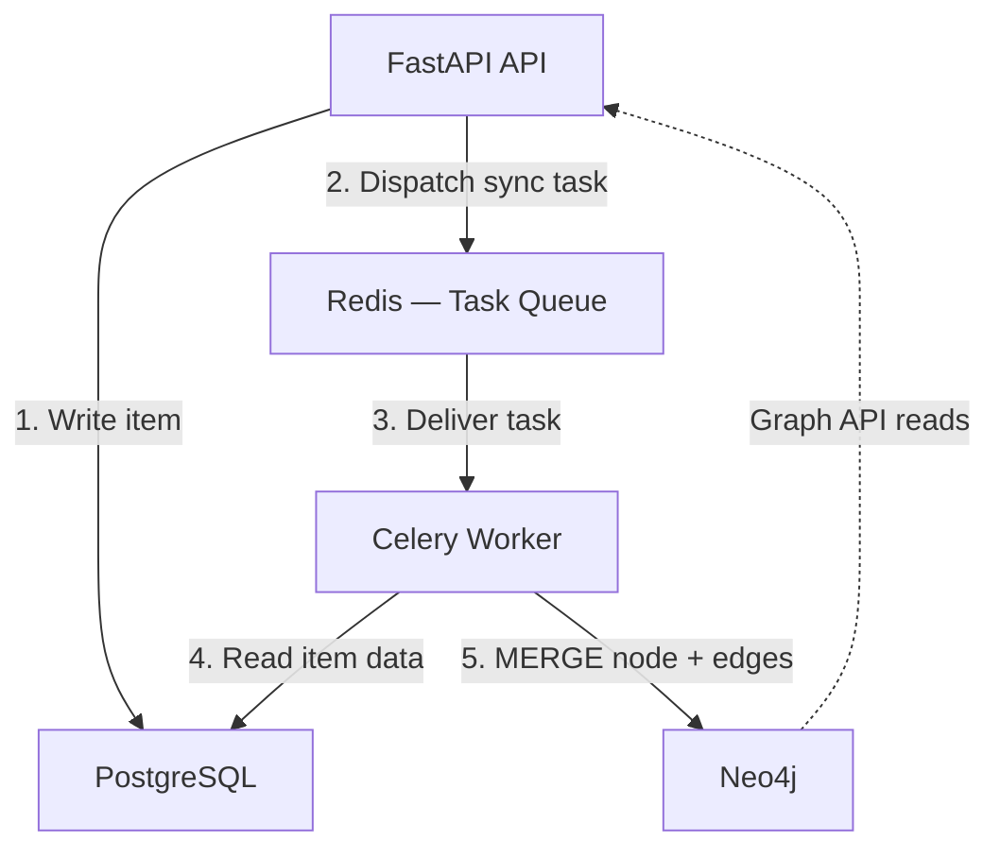
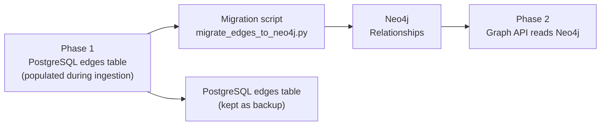

# Dual DB Sync Strategy — PostgreSQL + Neo4j

## Table of Contents

- [[#1. Source of Truth|Source of Truth]]
- [[#2. Sync Events|Sync Events]]
- [[#3. Sync Architecture|Sync Architecture]]
- [[#4. Failure Handling|Failure Handling]]
- [[#5. Full Rebuild Procedure|Full Rebuild Procedure]]
- [[#6. Phase 1 → Phase 2 Migration|Phase 1 → Phase 2 Migration]]
- [[#7. Consistency Guarantees|Consistency Guarantees]]
- [[#8. References|References]]

---

## 1. Source of Truth

**PostgreSQL is always the source of truth.**

Neo4j is a **derived, eventually-consistent projection** of the graph subset of PostgreSQL data. This means:

- If Neo4j goes down, no user data is lost
- Neo4j can be fully rebuilt from PostgreSQL at any time
- All writes go to PostgreSQL first; Neo4j is updated asynchronously via Celery
- Any conflict between the two databases is resolved in favour of PostgreSQL

```
PostgreSQL  ──►  canonical item and edge data
     │
     │  async (Celery)
     ▼
Neo4j       ──►  graph traversal view of that data
```

---

## 2. Sync Events

| Trigger | Celery Task | Neo4j Operation |
|---|---|---|
| New item ingested | `sync_item_to_neo4j(item_id)` | `MERGE (:Item {...})` |
| Item tags/notes edited | `recompute_edges(item_id)` | Delete stale edges, re-run generation |
| Item folder changed | `update_item_node(item_id)` | `SET n.folder = $folder` |
| Item soft-deleted | `soft_delete_node(item_id)` | `SET n.deleted = true` (keep node, hide from queries) |
| Item permanently deleted | `delete_node_from_neo4j(item_id)` | `DETACH DELETE` |
| User manually links two items | `create_user_link(src, tgt)` | `CREATE (:USER_LINK)` |
| User removes a manual link | `delete_user_link(src, tgt)` | `MATCH ... DELETE r` |
| User account deleted (GDPR) | `delete_user_graph(user_id)` | `MATCH (n:Item {userId}) DETACH DELETE n` |

---

## 3. Sync Architecture



**Why async and not synchronous?**

Writing to Neo4j synchronously in the API request path would add ~50–200ms latency per request (Neo4j Bolt round trip). The graph view is not latency-critical in the same way the save confirmation is. The user sees their item appear in the library immediately (PostgreSQL write confirmed); the graph updates within seconds once the Celery task runs.

---

## 4. Failure Handling

### Neo4j goes down

```python
# Celery task with exponential backoff
@celery_app.task(bind=True, max_retries=5, default_retry_delay=30)
async def sync_item_to_neo4j(self, item_id: str, user_id: str):
    try:
        await neo4j_client.merge_item(...)
        await generate_all_edges(item_id, user_id)
    except Neo4jConnectionError as exc:
        # Will retry: 30s, 60s, 120s, 240s, 480s
        raise self.retry(exc=exc, countdown=30 * (2 ** self.request.retries))
```

Tasks that fail after all retries go to a `dead_letter` queue in Redis. When Neo4j recovers, a background job replays dead-letter tasks in order.

### Stale graph (Neo4j lags behind PostgreSQL)

Because sync is async, there is a brief window where a newly ingested item exists in PostgreSQL but not yet in Neo4j. This is acceptable — the graph view is not a real-time feed. The `item.ready` WebSocket event fires after Neo4j sync completes, so the frontend only adds the node to the graph canvas once it's actually in Neo4j.

```python
# In ingest_item Celery task — WebSocket push AFTER Neo4j sync
await generate_all_edges(item_id, user_id)          # Neo4j sync
await websocket_push(user_id, "item.ready", item_id) # Only then notify frontend
```

### Detecting drift

A nightly Celery beat job compares node counts:

```python
@celery_app.task
async def check_neo4j_drift():
    async with get_pg_session() as db:
        pg_count = await db.scalar(
            "SELECT COUNT(*) FROM items WHERE deleted_at IS NULL"
        )
    neo_count = await neo4j_client.run(
        "MATCH (n:Item) WHERE n.deleted IS NULL RETURN count(n) AS c"
    )
    drift = abs(pg_count - neo_count[0]["c"])
    if drift > 50:
        # Alert via Datadog + trigger partial rebuild for affected users
        datadog.gauge("neo4j.drift", drift)
        await trigger_partial_rebuild()
```

---

## 5. Full Rebuild Procedure

Neo4j can be fully rebuilt from PostgreSQL at any time. This is the recovery procedure for data corruption or a fresh deployment.

```python
# scripts/rebuild_neo4j.py
import asyncio
from app.db import get_pg_session
from app.graph.neo4j_client import neo4j_client

BATCH_SIZE = 500

async def rebuild():
    print("Step 1: Clear Neo4j")
    await neo4j_client.run("MATCH (n) DETACH DELETE n")

    print("Step 2: Recreate constraints and indexes")
    await neo4j_client.run("""
        CREATE CONSTRAINT item_unique IF NOT EXISTS
          FOR (n:Item) REQUIRE n.id IS UNIQUE
    """)

    print("Step 3: Migrate items in batches")
    async with get_pg_session() as db:
        offset = 0
        while True:
            rows = await db.execute("""
                SELECT id, user_id, title, content_type, folder_id,
                       tags, view_count, is_starred, created_at
                FROM items
                WHERE deleted_at IS NULL
                ORDER BY created_at
                LIMIT :limit OFFSET :offset
            """, {"limit": BATCH_SIZE, "offset": offset})
            items = rows.fetchall()
            if not items:
                break

            # Batch MERGE using UNWIND
            await neo4j_client.run("""
                UNWIND $items AS item
                MERGE (n:Item {id: item.id})
                SET n += item
            """, items=[dict(r) for r in items])

            offset += BATCH_SIZE
            print(f"  Migrated {offset} items...")

    print("Step 4: Rebuild edges from edges table")
    async with get_pg_session() as db:
        offset = 0
        while True:
            rows = await db.execute("""
                SELECT source_id, target_id, edge_type, weight
                FROM edges
                ORDER BY created_at
                LIMIT :limit OFFSET :offset
            """, {"limit": BATCH_SIZE, "offset": offset})
            edges = rows.fetchall()
            if not edges:
                break

            await neo4j_client.run("""
                UNWIND $edges AS e
                MATCH (a:Item {id: e.source_id}), (b:Item {id: e.target_id})
                CALL apoc.merge.relationship(a, e.edge_type, {}, {weight: e.weight}, b)
                YIELD rel RETURN rel
            """, edges=[dict(r) for r in edges])

            offset += BATCH_SIZE
            print(f"  Migrated {offset} edges...")

    print("Rebuild complete.")

if __name__ == "__main__":
    asyncio.run(rebuild())
```

**Estimated rebuild time** (rough): 10,000 items + 30,000 edges ≈ 2–3 minutes. Acceptable for a recovery operation.

---

## 6. Phase 1 → Phase 2 Migration

The `edges` table in PostgreSQL populated during Phase 1 becomes the seed data for Neo4j in Phase 2.



### Migration checklist

- [ ] Deploy Neo4j service (Docker or AuraDB)
- [ ] Run schema setup (constraints + indexes)
- [ ] Run `rebuild_neo4j.py` — migrates items + edges from PostgreSQL
- [ ] Verify: `neo4j_count == postgres_count` for items and edges
- [ ] Enable feature flag `USE_NEO4J_GRAPH=true` in config
- [ ] Deploy updated graph API routes (read from Neo4j)
- [ ] Monitor for 1 week — watch for drift alerts in Datadog
- [ ] After confidence period: deprecate direct `edges` table reads in API (keep table)

> **Do not drop the `edges` table.** It costs little to keep and is the fastest path to rollback if Neo4j has issues.

---

## 7. Consistency Guarantees

| Guarantee | Level |
|---|---|
| Data durability | Strong — PostgreSQL is source of truth, 99.999% durability |
| Graph consistency | Eventual — Neo4j lags by seconds under normal load |
| Graph availability | Degraded gracefully — if Neo4j is down, graph view shows cached data or empty state; all other features unaffected |
| GDPR erasure | Strong — `delete_user_graph` runs synchronously on account deletion request |

---

## 8. References

- [Celery — Task retries and dead-letter queues](https://docs.celeryq.dev/en/stable/userguide/tasks.html#retrying)
- [Neo4j APOC — Merge relationship](https://neo4j.com/labs/apoc/5/graph-updates/graph-refactoring/)
- [Eventual consistency patterns](https://martinfowler.com/articles/patterns-of-distributed-systems/two-phase-commit.html)
- [Datadog custom metrics](https://docs.datadoghq.com/metrics/custom_metrics/)

---

*Related notes: [[Knowledge-Graph-Implementation]] · [[Neo4j-Setup-and-Schema]] · [[pgvector-Edge-Generation]]*
